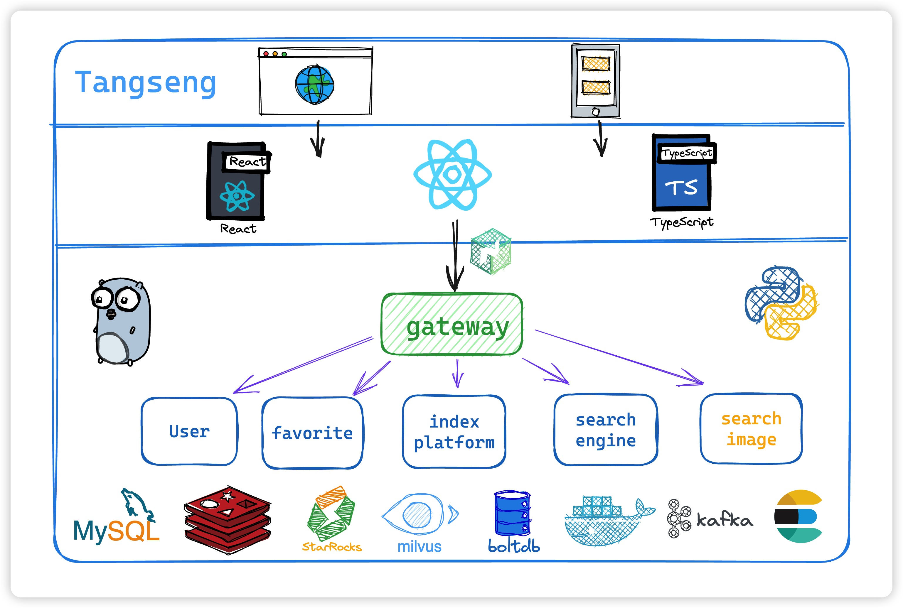
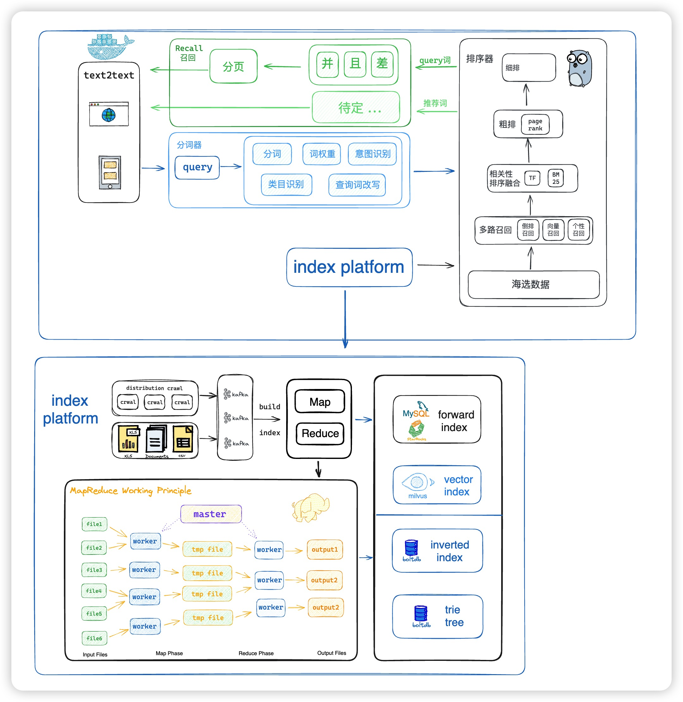
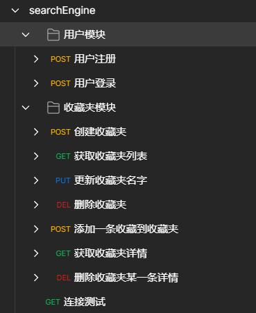

# Tangseng 基于Go语言的搜索引擎

Tangseng是一个基于Go语言的分布式搜索引擎

## 项目大体框架

1、gin作为http框架，grpc作为rpc框架，etcd作为服务发现。\
2、总体服务分成`用户模块`、`收藏夹模块`、`索引平台`、`搜索引擎(文字模块)`、`搜索引擎(图片模块)`。\
3、分布式爬虫爬取数据，并发送到kafka集群中，再落库消费。 (虽然爬虫还没写，但不妨碍我画饼...) \
4、搜索引擎模块的文本搜索单独设立使用boltdb存储index。\
5、使用trie tree实现词条联想。 \
6、图片搜索使用ResNet50来进行向量化查询 + Milvus or Faiss 向量数据库的查询 (开始做了...)。




## 🧑🏻‍💻 前端地址

前端用的是 react, but still coding

[react-tangseng](https://github.com/CocaineCong/react-tangseng)

# 🌈 项目主要功能
## 1. 用户模块

- 登录注册

## 2. 收藏夹模块

- 创建/更新/删除/展示 收藏夹
- 将搜索结果的url进行收藏夹的创建/删除/展示

## 3. 索引平台
### 3.1 文本存储

#### 正排库

目前存放在mysql中，但后续会放到starrocks

#### 倒排库

> * x.inverted 存储倒排索引文件
> * x.trie_tree 存储词典trie树

目前使用mapreduce来构建倒排索引
- map任务将数据拆分`{token:"xxx",doc_id:1}`形式
- reduce任务将所有相同 token 的 doc_id 合并在一起 

存储doc id使用`roaring bitmap`这种数据结构来存储，尽可能的压缩空间

在索引平台中，离线构建的倒排索引会进行合并操作
- 每天产生的数据将存放同一个文件中. eg: 2023-10-03.inverted
- 每周的周日会将这一周的数据都合并到当月中. eg: 2023-10.inverted
- 每月的最后一天会把该月合并到该季度中. eg: 2023-Autumn.inverted

#### 向量库

向量库采用milvus或者faiss来存储向量信息

## 4. 搜索模块

### 4.1 文本搜索

- 倒排召回

因为boltdb是kv数据库，所以直接获取所有的对应的query对应的doc id即可

- 向量召回

query向量化，并从milvus或者faiss中查询获取

- 融合

将倒排和向量两个纬度的召回进行融合

- 排序

bm25进行排序


### 4.2 图片搜索
- resnet50 模型召回


- 向量召回

query向量化，并从milvus或者faiss中查询获取

- 融合

将两个种向量的召回进行融合，去重

- 排序

待定，向量的排序

### 4.3 未来规划
#### 1.架构相关

- [ ] 引入降级熔断
- [ ] 引入jaeger进行链路追踪
- [ ] 引入skywalking or prometheus进行监控
- [ ] 抽离dao的init，用key来获取相关数据库实例

#### 2.功能相关

- [x] 构建索引的时候太慢了.后面加上并发，建立索引的地方加上并发
- [ ] 索引压缩，inverted index，也就是倒排索引表，后续改成存offset,用mmap
- [x] 相关性的计算要考虑一下，TFIDF，bm25
- [x] 使用前缀树存储联想信息
- [ ] 哈夫曼编码压缩前缀树
- [ ] inverted 和 trie tree 的存储支持一致性hash分片存储
- [ ] 词向量，pagerank
- [x] 分词加入ik分词器
- [x] 构建索引平台，计算存储分离，构建索引与召回分开
- [ ] 并且差运算
- [ ] 分页，排序
- [ ] 纠正输入的query,比如“陆加嘴”-->“陆家嘴”
- [x] 输入进行词条可以进行联想，比如 “东方明” 提示--> “东方明珠”
- [x] 目前是基于块的索引方法，后续看看能不能改成分布式mapreduce来构建索引 (6.824 lab1)
- [ ] 在上一条的基础上再加上动态索引（还不知道上一条能不能实现...）
- [x] 改造倒排索引，使用 roaring bitmap 存储docid (好难)
- [ ] 实现TF类
- [ ] 所有的输入数据都收口到starrocks，从starrocks读取来构建索引
- [x] 搜索完一个接着搜索，没有清除缓存导致结果是和上一个产生并集
- [x] 排序器优化




# ✨ 项目结构

## 1.tangseng 项目总体
```
tangseng/
├── app                   // 各个微服务
│   ├── favorite          // 收藏夹
│   ├── gateway           // 网关
│   ├── index_platform    // 索引平台
│   ├── mapreduce         // mapreduce 服务(已弃用)
│   ├── gateway           // 网关
│   ├── search_engine     // 搜索微服务(文本)
│   ├── search_img        // 搜索微服务(图片)
│   └── user              // 用户模块微服务
├── bin                   // 编译后的二进制文件模块
├── config                // 配置文件
├── consts                // 定义的常量
├── doc                   // 接口文档
├── idl                   // protoc文件
│   └── pb                // 放置生成的pb文件
├── loading               // 全局的loading，各个微服务都可以使用的工具
├── logs                  // 放置打印日志模块
├── pkg                   // 各种包
│   ├── bloom_filter      // 布隆过滤器
│   ├── ctl               // 用户信息相关
│   ├── discovery         // etcd服务注册、keep-alive、获取服务信息等等
│   ├── es                // es 模块
│   ├── jwt               // jwt鉴权
│   ├── kfk               // kafka 生产与消费
│   ├── logger            // 日志
│   ├── mapreduce         // mapreduce服务
│   ├── res               // 统一response接口返回
│   ├── retry             // 重试函数
│   ├── trie              // 前缀树
│   ├── util              // 各种工具、处理时间、处理字符串等等..
│   └── wrappers          // 熔断
└── types                 // 定义各种结构体
```

## 2.gateway 网关部分
```
gateway/
├── cmd                   // 启动入口
├── internal              // 业务逻辑（不对外暴露）
│   ├── handler           // 视图层
│   └── service           // 服务层
│       └── pb            // 放置生成的pb文件
├── logs                  // 放置打印日志模块
├── middleware            // 中间件
├── routes                // http 路由模块
└── rpc                   // rpc 调用
```

## 3.user && favorite 用户与收藏夹模块
```
user/
├── cmd                   // 启动入口
└── internal              // 业务逻辑（不对外暴露）
    ├── service           // 业务服务
    └── repository        // 持久层
        └── db            // db模块
            ├── dao       // 对数据库进行操作
            └── model     // 定义数据库的模型
```

## 4.search-engine 搜索引擎模块

```
seach-engine/
├── analyzer              // 分词器
├── cmd                   // 启动入口
├── data                  // 数据层
├── ranking               // 排序器
├── respository           // 存储信息
│   ├── spark             // spark 存储,后续支持...
│   └── storage           // boltdb 存储(后续迁到spark)
├── service               // 服务
├── test                  // 测试文件
└── types                 // 定义的结构体
```

## 5. index platform索引平台

```
seach-engine/
├── analyzer              // 分词器
├── cmd                   // 启动入口
├── consts                // 放置常量
├── crawl                 // 分布式爬虫
├── input_data            // csv文件(爬虫未实现)
├── respository           // 存储信息
│   ├── spark             // spark 存储,后续支持...
│   └── storage           // boltdb 存储(后续迁到spark)
├── service               // 服务
└── trie                  // 存放trie树
```

# 项目文件配置

将config文件夹下的`config.yml.example`文件重命名成`config.yml`即可。

```yaml
server:
  port: :4000
  version: 1.0
  jwtSecret: "38324-search-engine"

mysql:
  driverName: mysql
  host: 127.0.0.1
  port: 3306
  database: search_engine
  username: search_engine
  password: search_engine
  charset: utf8mb4

es:
  EsHost: 127.0.0.1
  EsPort: 9200
  EsIndex: mylog

vector:
  server_address:
  timeout: 3

milvus:
  server_address:
  timeout: 3

redis:
  redisDbName: 4
  redisHost: 127.0.0.1
  redisPort: 6379
  redisPassword: 123456
  redisNetwork: "tcp"

etcd:
  address: 127.0.0.1:2379

services:
  gateway:
    name: gateway
    loadBalance: true
    addr:
      - 127.0.0.1:20001

  user:
    name: user
    loadBalance: false
    addr:
      - 127.0.0.1:20002

  favorite:
    name: favorite
    loadBalance: false
    addr:
      - 127.0.0.1:20003

  search_engine:
    name: search_engine
    loadBalance: false
    addr:
      - 127.0.0.1:20004

  index_platform:
    name: index_platform
    loadBalance: false
    addr:
      - 127.0.0.1:20005

  mapreduce:
    name: mapreduce
    loadBalance: false
    addr:
      - 127.0.0.1:20006

starrocks:
  username: root
  password:
  database: test
  load_url: localhost:8083
  host: localhost
  port: 9030
  charset: utf8mb4

kafka:
  address:
    - 127.0.0.1:10000
    - 127.0.0.1:10001
    - 127.0.0.1:10002

domain:
  user:
    name: user
  favorite:
    name: favorite
  search_engine:
    name: search_engine
  index_platform:
    name: index_platform
  mapreduce:
    name: mapreduce
```


# 项目启动
## makefile启动

启动命令

```shell
make env-up         # 启动容器环境
make user           # 启动用户摸块
make task           # 启动任务模块
make gateway        # 启动网关
make env-down       # 关闭并删除容器环境
```

其他命令
```shell
make run   # 启动所有模块
make proto # 生成proto文件，如果proto有改变的话，则需要重新生成文件
```
生成.pb文件所需要的工具有`protoc-gen-go`,`protoc-gen-go-grpc`,`protoc-go-inject-tag`


## 手动启动

1. 利用compose快速构建环境

```shell
docker-compose up -d
```

2. 保证mysql,etcd活跃, 在 app 文件夹下的各个模块的 cmd 下执行

```go
go run main.go
```

# 导入接口文档

打开postman，点击导入


选择导入文件


效果


